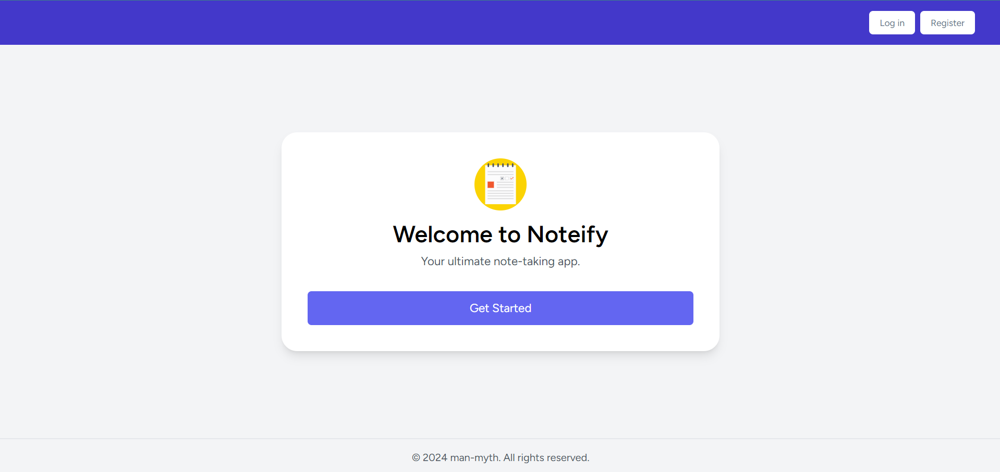

# Noteify
*Your Ultimate Note Sharing App*

 

## Introduction
Noteify is a powerful and user-friendly app designed to help you create, manage, and share notes effortlessly. Whether you want to keep your notes private or share them with your contacts, Noteify provides a seamless experience for all your note-taking needs.

### Features
- **Create Notes**: Easily create notes that can be either public or private.
- **User Accounts**: Notes are securely associated with your personal account.
- **Share Notes**: Share your notes with your contacts quickly and easily.
- **Scheduled Sharing**: Schedule a time to send your notes automatically.

## Screenshots

---

## Developer Section

### Tech Stack
- **Tailwind CSS**: Utility-first CSS framework for rapid UI development.
- **Alpine.js**: Minimal framework for composing JavaScript behavior in your HTML.
- **Laravel**: PHP framework for web artisans.
- **Livewire**: Full-stack framework for Laravel that makes building dynamic interfaces simple.
- **Breeze**: Simple, minimal Laravel authentication.
- **Livewire Volt**: Enhanced components for Livewire.
- **WireUI** : Simple, Fast, and Elegant Blade Components for Alpine.js, Tailwind, Livewire, and the Tall Stack.

### Setup Instructions
To set up the project locally, follow these steps:

1. Clone the repository:
    ```bash
    git clone https://github.com/man-myth/notes-app.git
    ```
2. Navigate to the project directory:
    ```bash
    cd notes-app
    ```
3. Install the PHP dependencies:
    ```bash
    composer install
    ```
4. Install the Node.js dependencies:
    ```bash
    npm install
    ```
5. Run the development server:
    ```bash
    php artisan serve
    ```
6. Compile the assets:
    ```bash
    npm run dev
    ```

### Environment Configuration
Ensure you have a `.env` file with the necessary configurations. You can copy the `.env.example` file and modify it as needed:
```bash
cp .env.example .env
php artisan key:generate
